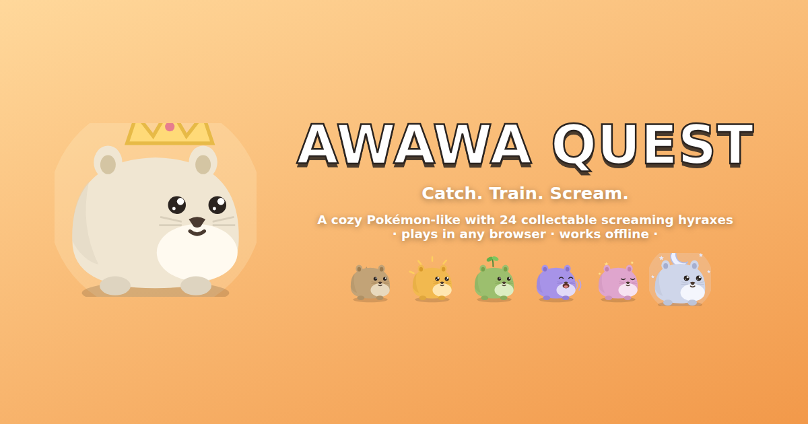
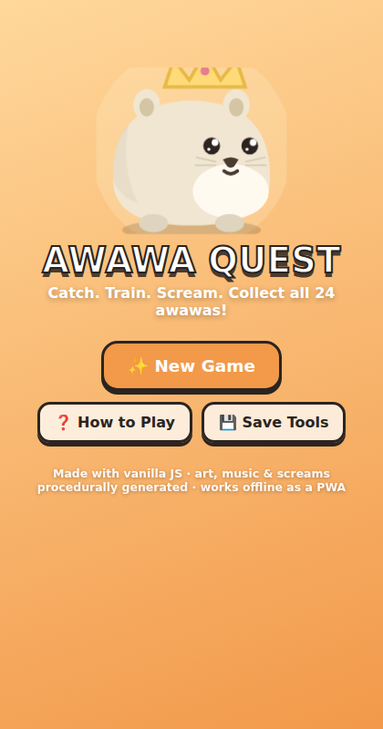
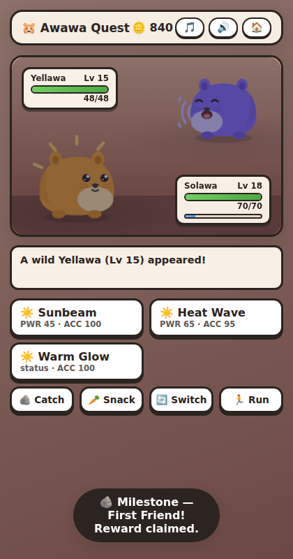
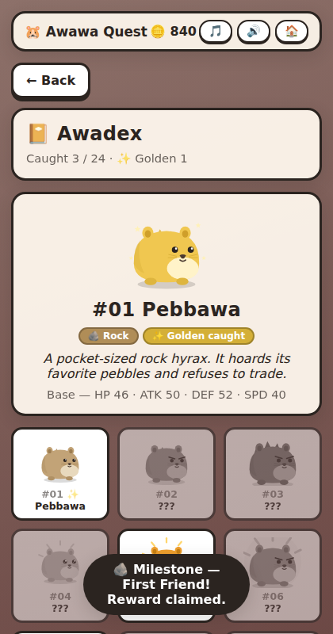

# 🐹 Awawa Quest

> **Catch. Train. Scream.** A cozy Pokémon-like browser game starring **awawas** —
> adorable, screaming hyraxes. 24 species, boss trials, a rival, day/night,
> an endless tower and daily challenge runs. Zero dependencies, zero build step,
> zero image assets: every sprite is procedural SVG and every note is synthesized.



| | | |
|:-:|:-:|:-:|
|  |  |  |

## ▶ Play

**Open `index.html`** — that's it. Or serve the folder for full PWA goodness
(installable, offline, home-screen icon):

```sh
python3 -m http.server 8080    # or: npx http-server -p 8080
# then visit http://localhost:8080
```

**Controls:** everything is tappable/clickable. On PC: `1–9` battle actions &
hub menu, `E` explore, `R` rest, `P` party, `T` travel, `X` awadex, `J` journal,
`B` shop, `Esc` back, `Enter` continue.

**Your progress is safe:** auto-save after every action + automatic backup copy
+ save-on-tab-close, with corruption recovery. Move between devices with
export/import save codes (title screen → 💾 Save Tools).

## Core game loop

```
        ┌──────────────────────────────────────────────┐
        │                                              │
        ▼                                              │
   ① EXPLORE a zone  ──►  ② ENCOUNTER a wild awawa     │
        │   (time of day        │      (or a trainer,  │
        │    advances,          │       or your rival) │
        │    items, coins)      ▼                      │
        │                  ③ BATTLE (turn-based,       │
        │                     type triangles, charms)  │
        │                        │                     │
        │              ┌─────────┴─────────┐           │
        │              ▼                   ▼           │
        │         ④ CATCH it          defeat it        │
        │        (fills Awadex)      (XP + coins)      │
        │              │                   │           │
        │              └─────────┬─────────┘           │
        │                        ▼                     │
        │              ⑤ TRAIN, EVOLVE & BOND          │
        │                        │                     │
        │                        ▼                     │
        └──────────── ⑥ PROGRESS: badges from ─────────┘
                         Elder Trials, milestones,
                         golden hunting, the Scream
                         Tower, daily runs, and the
                         post-game Moonlit Isles
```

## Systems

| System | Design |
|---|---|
| **Types** | Two triangles: Rock ▶ Sun ▶ Leaf ▶ Rock and Sound ▶ Dream ▶ Wind ▶ Sound (2× / ½×), STAB 1.5×. |
| **Species** | 24 awawas across 8 zones: 3 starter lines with 3 stages, rares, and 3 legendaries. All drawn procedurally from one parameterized SVG hyrax. |
| **Battle** | Turn-based with speed order, stat stages, crits, priority/heal/drain moves, floating damage numbers, and a heal-when-hurt enemy AI. |
| **Catching** | Pebbles → Smooth Stones → Comfy Blankets; odds scale with remaining HP and rarity, shown live as a percentage. |
| **Growth** | Classic stat curves, level-up learnsets, evolutions, a move editor (recompose any 4-move set), nicknames, and **bond**: hearts grow from battles & snacks — 3♥ = +5% damage, 5♥ = +10%. |
| **Elder Trials** | A boss guardian per zone. First win → badge + purse (badges gate travel); rematches pay less. Beat THE GREAT AWAWA for the ending. |
| **Trainers & rival** | 13 wandering trainers with themed teams and quips, plus **Scree** 😼 — five story fights, always fielding the starter line that counters yours. |
| **Day/night** | Dawn/day/dusk/night advances every 10 steps (rest skips a phase). Tints the world, reshapes encounters — Dream awawas own the night; dawn doubles shiny odds. |
| **Golden awawas** | 1-in-40 gilded variants (1-in-20 at dawn, 1-in-30 in the tower): triple coins, permanent ✨ Awadex marker. |
| **Held charms** | 8 equippables: type boosters (+25%), Lucky Clover (15% crit), Soft Moss (6% regen/round). |
| **Scream Tower** | Post-game endless gauntlet: escalating catchable floors, a boss every 5th, +20% HP between floors, leave-anytime banking, best-floor records. |
| **Daily Scream Run** | A 5-stage gauntlet seeded by the date — same species & shinies for every player, levels scaled to your party. Streak tracking, once-a-day rewards, no attrition. |
| **Moonlit Isles** | Post-game region: 3 zones, 6 new species incl. the legendary **Lunawa**, and a 6th badge from Tidemother Naia. |
| **Milestones** | 22 auto-claiming achievements paying coins & items, tracked in the Journal. |
| **Saves** | Versioned schema with migrations, automatic backup + corruption recovery, save-on-close, cross-device export/import codes. |
| **Tech** | Vanilla JS/CSS/SVG, ~2600 lines, no dependencies, no build. PWA: installable, fully offline via service worker. WebAudio generative soundtrack (per-zone themes + battle/boss) and synthesized hyrax cries. |

## Publish it (game jam / itch.io / GitHub Pages)

The game is 100% static files:

- **itch.io** — zip the repo folder (minus `.git`), upload as an HTML game,
  set `index.html` as the entry point, viewport 480×860 or fullscreen.
- **GitHub Pages** — Settings → Pages → deploy from branch, done.
  The service worker gives players offline play + install-to-home-screen.
- **Anywhere else** — any static host works; no server code, no analytics,
  no external requests at all.

## Code layout

```
index.html            shell, PWA registration, social meta
manifest.webmanifest  PWA manifest
sw.js                 offline cache (bump CACHE_VERSION on release)
css/style.css         all styling & animations
js/data.js            types, moves, 24 species, zones, elders, trainers,
                      rival, items, phases, milestones (pure data)
js/sprites.js         parameterized SVG hyrax renderer
js/audio.js           WebAudio cries, SFX & generative music
js/game.js            state, saves (backup/export/import), stats, XP,
                      catching, bond, daily seeds, tower/rival factories
js/battle.js          battle engine (turns, damage, effects, teams, AI)
js/ui.js              screens, rendering, battle presentation, keyboard
icons/, docs/         PWA icons, cover & screenshots
```

---

*All art, music, sounds and creatures are generated by code in this repo — no
external assets, trademarks or IP. Hyraxes really do scream like that.*
